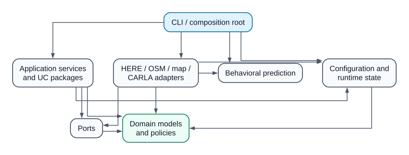
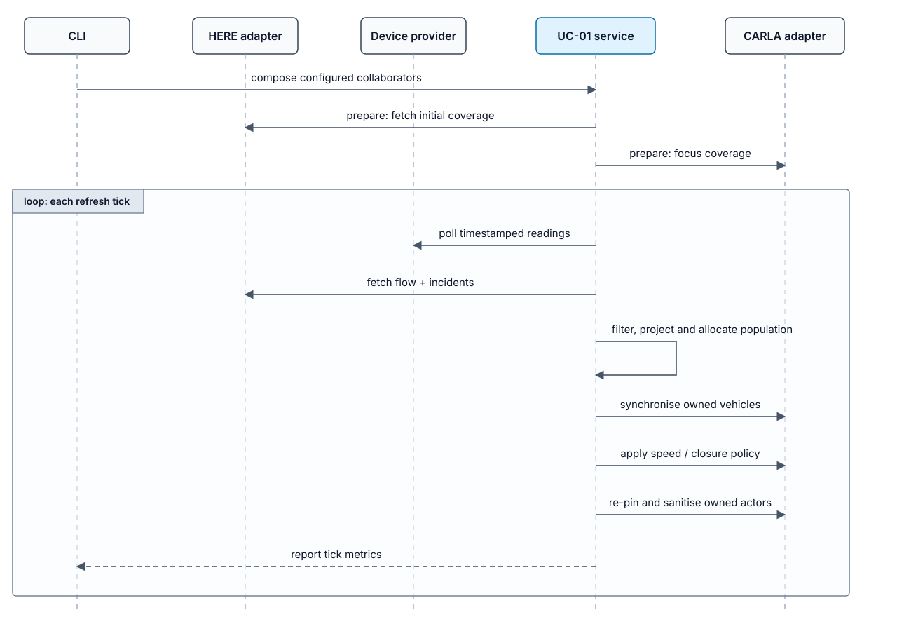
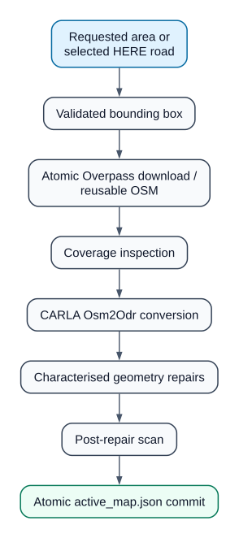
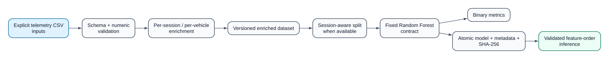

# MOTION architecture

## Dependency boundaries

MOTION is organised as a Python package with a single composition root.
The CLI builds the concrete HERE, OSM and CARLA adapters and passes them to
application services. UC packages contain orchestration or traceability
metadata; they do not contain private copies of external clients. Domain rules
remain importable without CARLA, Requests or the scientific stack.

These arrows represent imports between top-level package areas. Prediction has
its own schema and training contracts; it does not import `motion.domain`, which
currently contains UC-01's simulator-neutral traffic policies. The domain
performs no I/O and does not import CARLA, Requests, pandas or scikit-learn.
Dedicated UC packages do not import one another.

## Package responsibilities

| Package | Responsibility |
|---|---|
| `motion.domain` | Geographic value objects, map and traffic contracts, device semantics, population and speed policies. |
| `motion.ports` | Protocols for traffic acquisition, field observations, simulation and local map processing. |
| `motion.application` | Map provisioning, HERE-road selection and application orchestration. |
| `motion.application.use_cases` | One package per documented Macro UC; UC-01 owns executable orchestration, UC-02–UC-07 expose traceability metadata only. |
| `motion.infrastructure.here` | Credential-safe HTTP acquisition, parsing, incident enrichment and verifiable optional archival. |
| `motion.infrastructure.osm` | Overpass download with explicit timeout, contact metadata and atomic destination replacement. |
| `motion.infrastructure.maps` | OSM inspection, projection, Osm2Odr conversion and characterised OpenDRIVE repair tools. |
| `motion.infrastructure.carla` | Lazy CARLA loading, server/client lifecycle, map loading, actor ownership, population, TrafficManager commands, sanitisation and calibration. |
| `motion.prediction` | Versioned feature schema, telemetry enrichment, split/training/evaluation, model persistence and inference tracking for the existing behavioral experiment. |
| `motion.config` | Static settings, project-root discovery/override and separate versioned active-map state. |
| `motion.cli` | Argument parsing, composition and user output; no domain rules. |

UC-01 is the only executable macro use case. The package/status mapping and the
evidence for UC-02–UC-07 are recorded in [use-cases.md](use-cases.md).

## UC-01 data flow

The initial coverage preparation intentionally performs a HERE fetch before the
first tick because that was observable in the original workflow.  A failed flow
refresh falls back to device-derived uniform population while the root cause is
logged.  The update interval remains 60 seconds by default and the watchdog runs
between refreshes.

The CARLA adapter owns an explicit actor registry.  Cleanup and defect rules may
destroy only registered actors; unrelated ScenarioRunner or user vehicles are
not touched.  Expensive map generation happens once during provisioning and the
mirror loads the registered OpenDRIVE file instead of rebuilding it per check.

## Map and geospatial flow

The active-map record is committed only after conversion and repair complete.
Map names are constrained before becoming paths.  Coordinates use the numerical
conventions of the original implementation; these are local approximations, not
claims of survey-grade geodesy.

## Configuration and state

Static settings are loaded from the local `.env`, then overridden by process
environment variables. Secrets remain local. The generated map bounding box, paths, device
registry and selection filters are persisted atomically in
`var/runtime/active_map.json` with a schema version.  A read-only migration path
understands the former environment variables, but application code never writes
runtime state back into `.env`.

## Behavioral ML flow

The collector and prediction schema both include `weather_rain`.  Future labels
are calculated within the same session and vehicle, eliminating the original
cross-vehicle shift.  When a session identifier exists, the train/test split is
grouped by session; row-level fallback is retained only for legacy data without
session metadata and is reported as such.  This pipeline predicts a per-vehicle
behavioral incident label and is not an implementation of UC-04.

## External boundaries and optional dependencies

- HERE and Overpass require network access; HERE additionally requires a local
  API key.  Ordinary tests use sanitised fixtures and fake transports.
- The CARLA simulator remains a separate runtime. Its Python client is available
  through the optional `carla` extra and is loaded only when a live adapter is
  constructed or a CARLA command is executed; package import and offline tests
  do not require it.
- pandas, scikit-learn, NumPy and joblib are in the `ml` extra.
- Model files use pickle/joblib semantics.  A checksum detects corruption but
  is not a signature; only trusted artifacts may be loaded.

The retained numerical behaviors and deliberate corrections are listed in the
[non-regression matrix](non-regression.md). In particular, the CARLA adapter
tracks actor ownership so cleanup cannot remove unrelated world actors.
